# 📌 Ruslan Barysiuk | Flutter Developer with 3.5 Years of Experience

  

    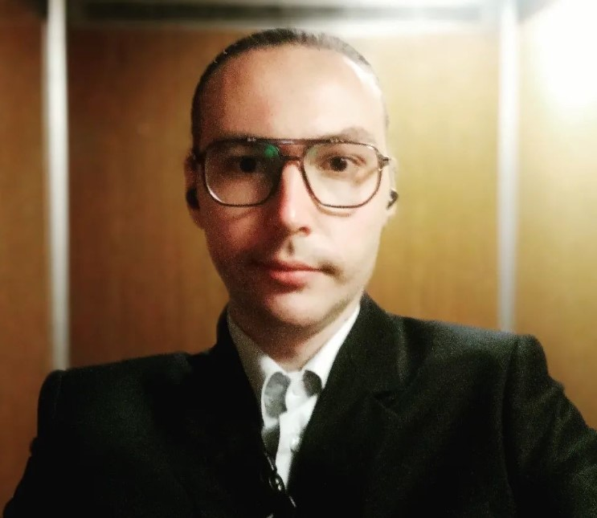
  

  

    
<strong>📍 Sri Lanka 🇱🇰 🇧🇾 Belarus</strong>

    ✉️ borisukruslan1@hotmail.com 
    📞 WhatsApp: +94741585577 
    📞 Telegram: <a href="https://t.me/flutterruslan">@flutterruslan</a> 
    🔗 LinkedIn: <a href="https://www.linkedin.com/in/ruslan-barysiuk-005b27236/">ruslan-barysiuk</a>
  

---

## 🛠 Skills

Specialized in building cross-platform applications using Flutter/Dart.

- **Core Technologies:** Flutter, Dart, BLoC, Riverpod, Freezed, Clean Architecture, Material 3  
- **Networking:** Dio, Http, REST API, WebSockets, gRPC  
- **Backend:** Firebase, Serverpod, PostgreSQL, Supabase  
- **DevOps:** Docker, GitHub Actions, TailScale, CI/CD  
- **Tools:** Postman, Swagger-to-Dart, Slang, Figma, Cursor AI, widgetbook  
- **Other:** web3dart, ankr, OneSignal

---

## 🌐 Project Links

- **Agro Took:** https://play.google.com/store/apps/details?id=app.agrotook  
- **Rabotnik24:** https://play.google.com/store/apps/details?id=com.rabotnik24.mobile  
- **SFERA:** https://play.google.com/store/apps/details?id=zone.sfera  
- **Kerla:** https://play.google.com/store/apps/details?id=com.ru.kerla  

---

## 💼 Work Experience

### forYou Inc (October 2024 — May 2025, 8 months)  
**Flutter Developer**  
Independently developed a marketplace app: authentication, filters, listings, localization (Slang). Used BLoC, Dio, Http, Material 3. Collaborated with backend via Postman. CI/CD, Docker, released to Google Play.

### Freelance (March 2024 — September 2024, 7 months)  
**Flutter Developer**  
Created mini-games with Flame, WebView apps, custom Kotlin + FFmpeg modules. Integrated swagger-to-dart, Telegram Mini App. CI/CD.

### Gybernaty Community (December 2023 — February 2024, 3 months)  
[gyber.org](https://gyber.org)  
**Flutter Developer**  
Built crypto wallets (custodial & non-custodial). Stack: Flutter, Serverpod, BLoC, web3dart, ankr.

### Kerla (August 2023 — November 2023, 4 months)  
**Flutter Developer**  
Developed e-commerce app with Riverpod, Serverpod, PostgreSQL. Filters, catalog, backend integration, CI/CD, Docker.

### Rabotnik24 (July 2022 — July 2023, 13 months)  
**Flutter Developer**  
Worked on a freelance marketplace: Clean Architecture, BLoC, Freezed, Firebase, Dio.

### SFERA (January 2022 — June 2022, 6 months)  
**Internship**  
Learned Flutter and contributed to a social platform.

---

## 🚀 Projects

### Agrotook – Agro-business Platform

  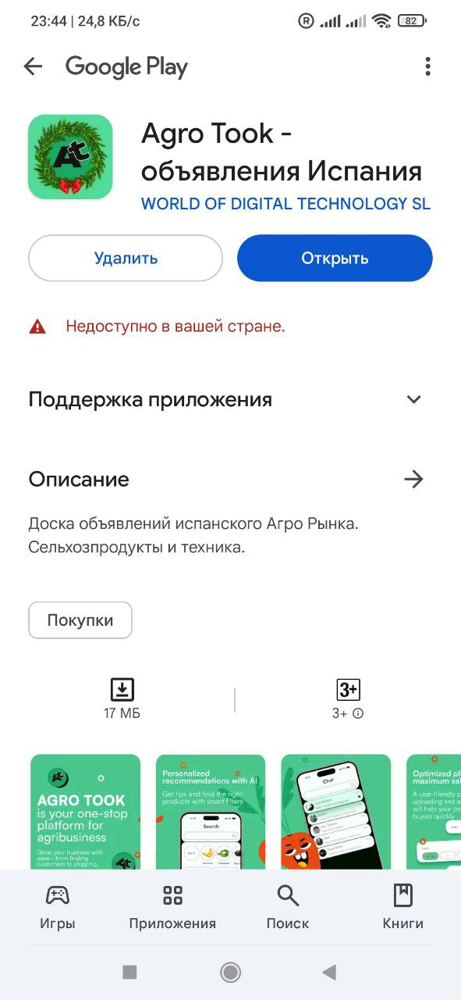 
  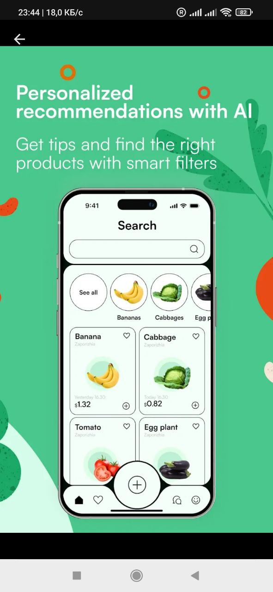 
  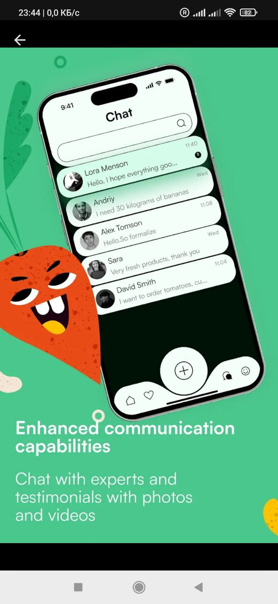 
  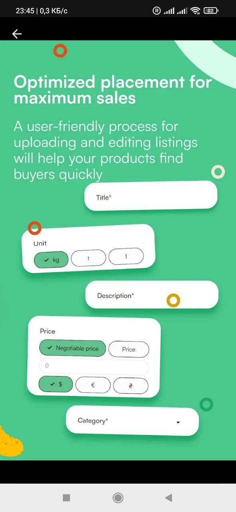 
  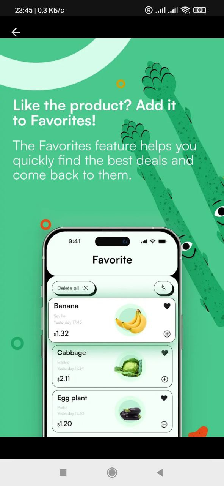

---

### Kerla – Marketplace

  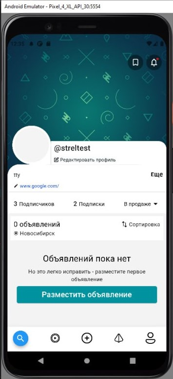 
  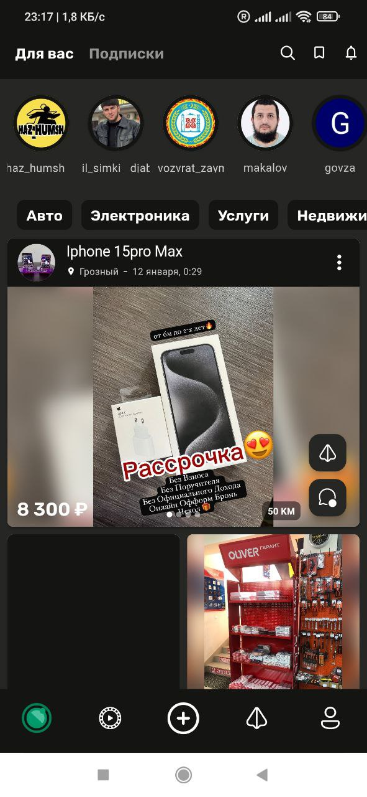 
  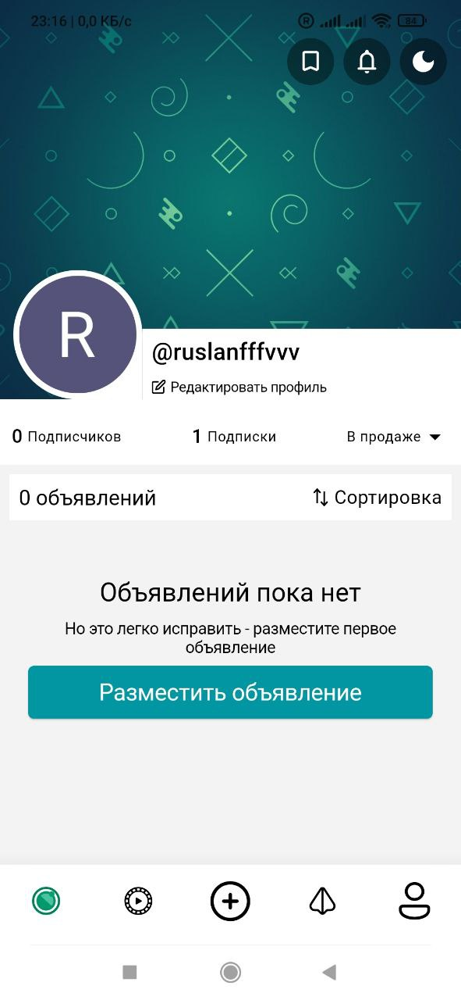 
  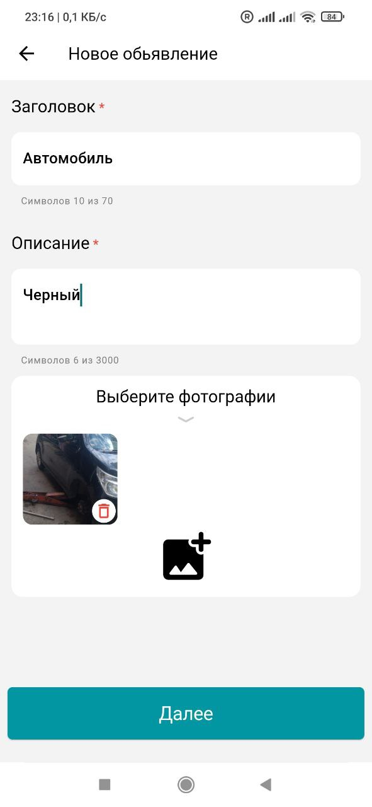 
  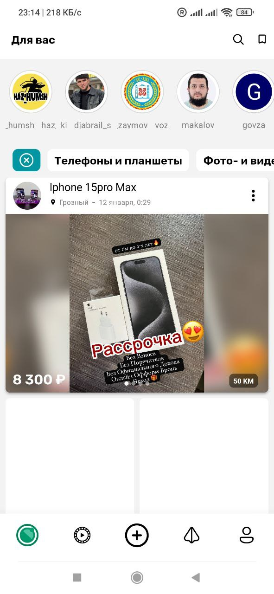

---

### Rabotnik24 – Freelance Platform

  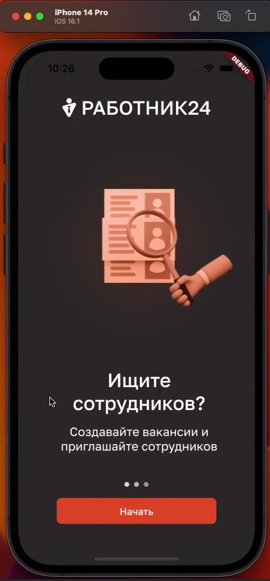 
  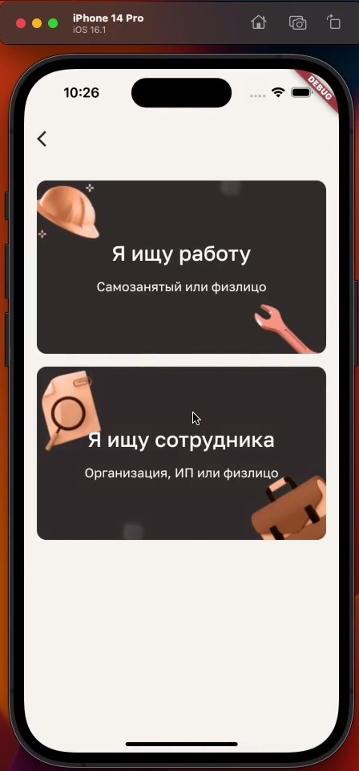 
  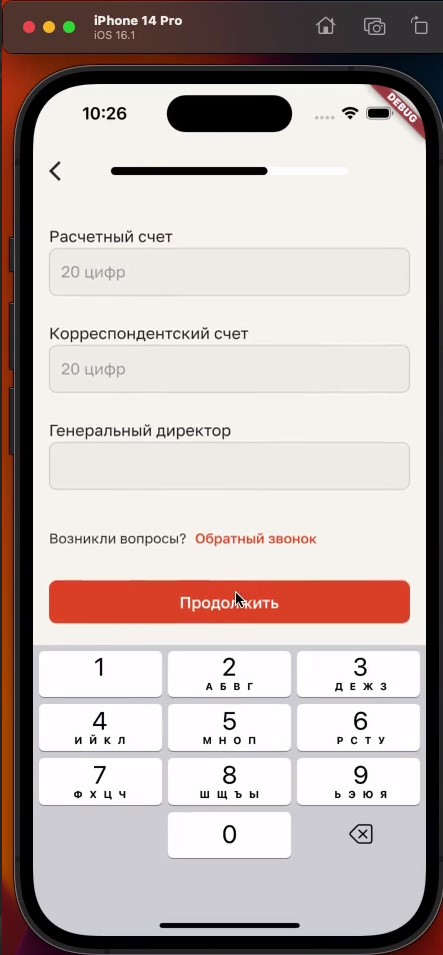 
  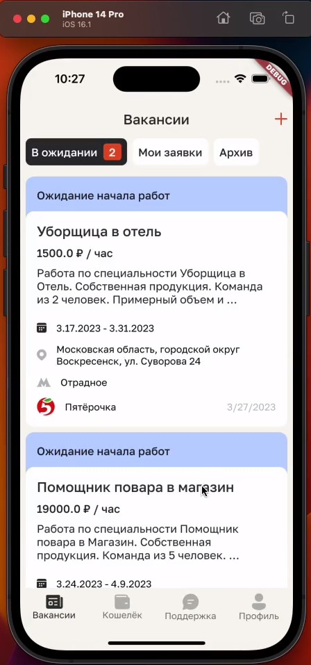 
  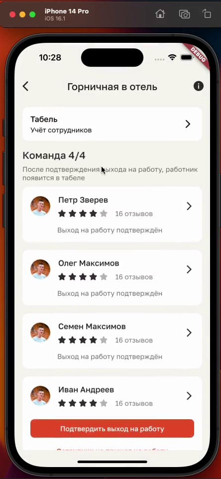

---

### Gyber – Crypto Wallet

  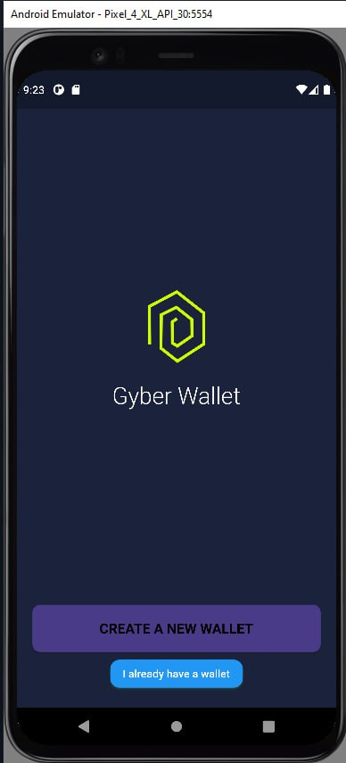 
  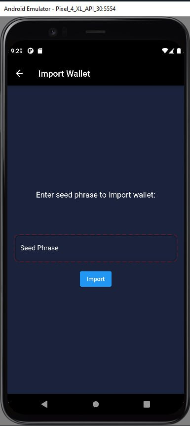 
  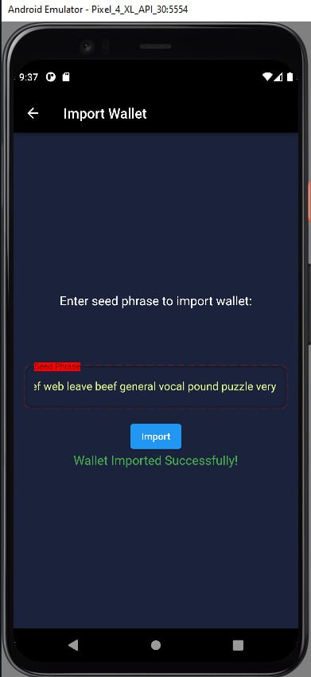 
  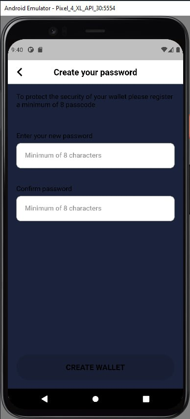 
  

---

### SFERA – Social Platform

  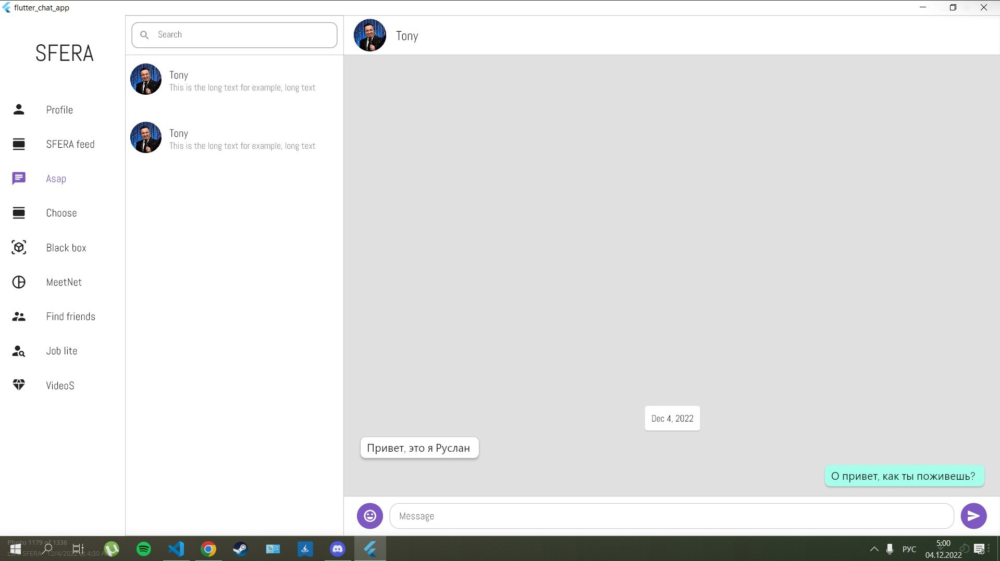

---

## 🗣 Languages

**Belarusian** — native  
**Russian** — fluent  
**English** — B2 (technical documentation, written communication)  
**Ukrainian** — reading and comprehension  
**Spanish** — beginner level

## 🎵 Hobbies

I play the Hang Drum and guitar, stream on TikTok, and enjoy art, crypto, NFTs, AI-generated art, YouTube, and other social platforms.

